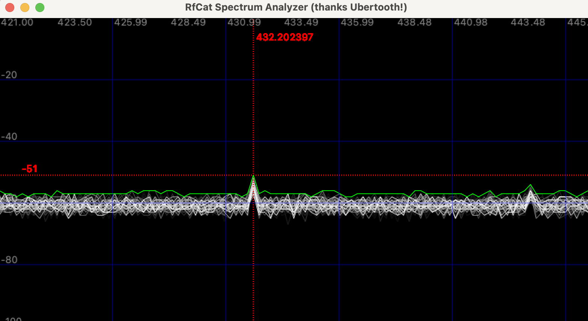

# RfCat (command line)

## show rfcat help

```shell
# show rfcat help (optional)
$ sudo rfcat -h
usage: rfcat [-h] [-r] [-i INDEX] [-s] [-f CENTFREQ] [-c INC] [-n SPECCHANS]
             [--bootloader] [--force]

optional arguments:
  -h, --help            show this help message and exit
  -r, --research        Interactive Python and the "d" instance to talk to
                        your dongle. melikey longtime.
  -i INDEX, --index INDEX
  -s, --specan          start spectrum analyzer
  -f CENTFREQ, --centfreq CENTFREQ
  -c INC, --inc INC
  -n SPECCHANS, --specchans SPECCHANS
  --bootloader          trigger the bootloader (use in order to flash the
                        dongle)
  --force               use this to make sure you want to set bootloader mode
                        (you *must* flash after setting --bootloader)


# show rfcat_bootloader help (optional)
$ rfcat_bootloader --help
CC Bootloader Download Utility
Usage:  /usr/local/bin/rfcat_bootloader serial_port command
Commands:
  download <hex_file>
    Download hex_file to the device.
  run
    Run the user code.
...
```

## Start ipython terminal

```shell
# run rfcat in terminal (start ipython terminal)
$ sudo rfcat -r

# select dongle
$ sudo rfcat -i [n] -r
```

```python
'RfCat, the greatest thing since Frequency Hopping!'

Research Mode: enjoy the raw power of rflib

currently your environment has an object called "d" for dongle.  this is how 
you interact with the rfcat dongle:
    >>> d.ping()
    >>> d.setFreq(433000000)
    >>> d.setMdmModulation(MOD_ASK_OOK)
    >>> d.makePktFLEN(250)
    >>> d.RFxmit("HALLO")
    >>> d.RFrecv()
    >>> print(d.reprRadioConfig())

In [1]:
```

## Start spectrum analyzer

```shell
# start spectrum analyzer without frequency
$ sudo rfcat --specan

# set frequency
$ sudo rfcat --specan --centfreq 434000000

# select dongle
$ sudo rfcat -i 0 --specan --centfreq 434000000
```



... will continue soon ...

[Go back](./readme.md)
