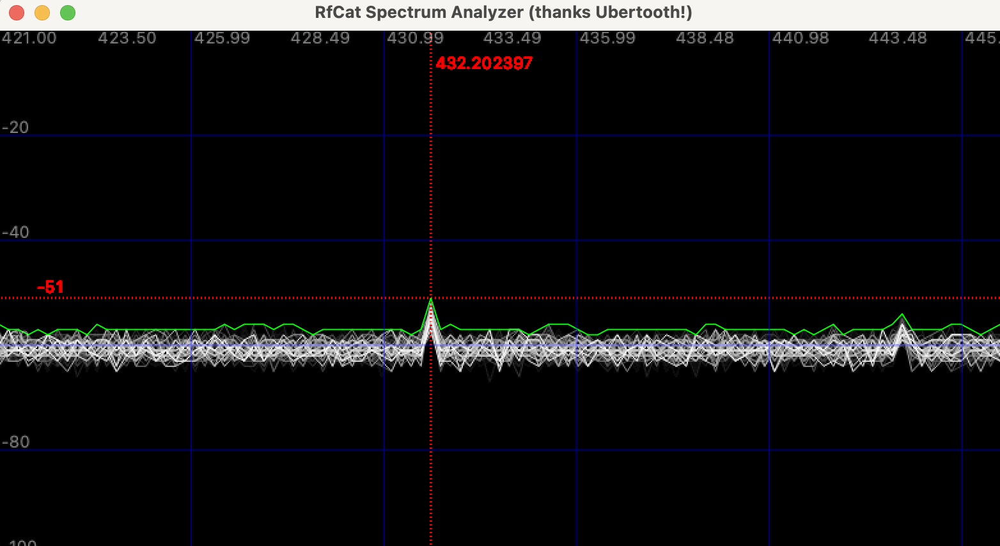

# RfCat (ipython)

**Show RfCat-IPython help**

```python
# show help
In [1]: help(d.setMdmModulation)

# show current configuration (optional)
In [2]: print(d.reprRadioConfig())
```

## USB Timeouts

_Note:_ To prevent the unplug/plug-in of YardStick One (_after your actions like receive or transmit_).

```python
# set idle mode
In [n]: d.setModeIDLE()
```

## Spectrum Analyzer

```python
# start spectrum analyzer without frequency
In [1]: d.specan()

# set frequency
In [2]: d.specan(434000000)
```



## Listen

```python
In [1]: d.setFreq(434000000)
In [2]: d.setMdmModulation(MOD_ASK_OOK)
In [3]: d.setMdmDRate(4800)
In [4]: d.lowball()
In [5]: d.setMaxPower()
In [6]: d.RFlisten()
```

## Work with multiple dongels

```shell
$ sudo rfcat -i 0 -r
```

1st interactive IPython terminal:

```python
In [1]: d.setFreq(434000000)
In [2]: d.setMdmModulation(MOD_ASK_OOK)
In [3]: print(d.reprRadioConfig())
```

```shell
$ sudo rfcat -i 1 -r
```

2nd interactive IPython terminal:

```python
In [1]: d.setFreq(868000000)
In [2]: d.setMdmModulation(MOD_2FSK)
In [3]: print(d.reprRadioConfig())
```

... will continue soon ...

[Go back](./readme.md)
